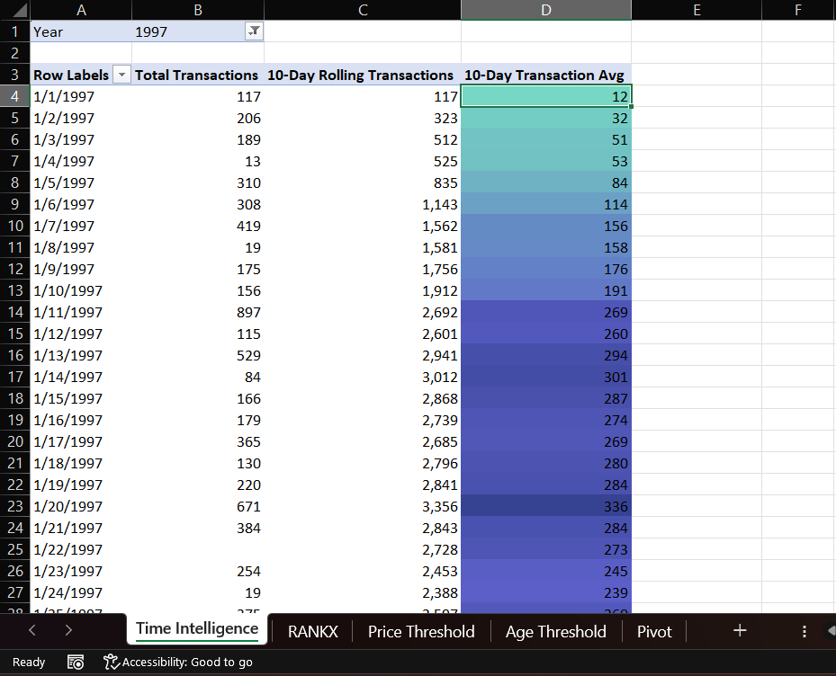
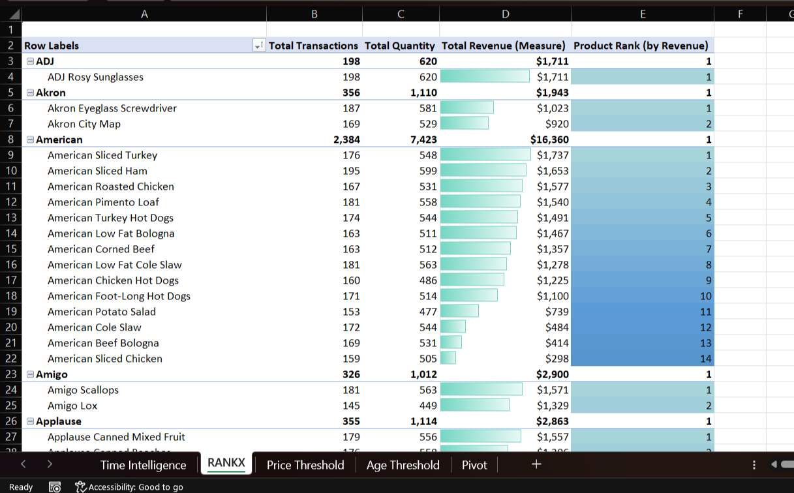
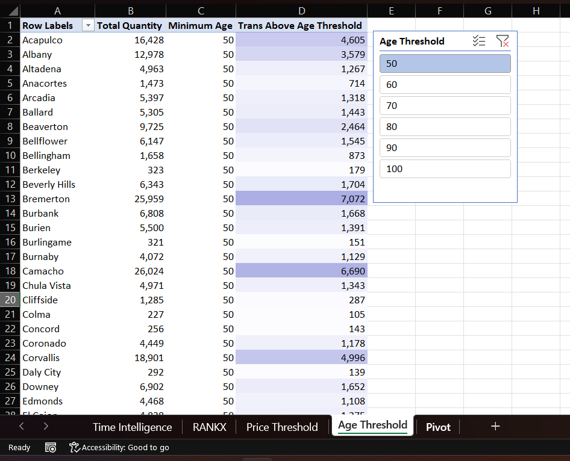

# FreshBasket Revenue Analysis

## 📌 Overview  
This project analyzes revenue data for **FreshBasket**, focusing on trends, key performance metrics, and insights to drive data-driven decisions. The analysis was performed using **Excel**, leveraging advanced features such as:  

- ✅ **Power Query** for data cleaning and transformation  
- ✅ **Power Pivot** for data modeling  
- ✅ **DAX (Data Analysis Expressions)** for advanced calculations  
- ✅ **Pivot Tables & Charts** for visualization and reporting  

## 📊 Key Insights  
- 📈 **Revenue trends** over time  
- 🛒 **Product/category performance** analysis  
- 👥 **Customer segmentation** and purchasing behavior  
- 💰 **Top-selling products & revenue contribution**  

## 🖼 Screenshots  
### 1️⃣ Time Intelligence Analysis  

### 2️⃣ Revenue Ranking & Product Performance

### 3️⃣ Customer Segmentation

## 📂 Contents  
- **`FreshBasket Revenue Analysis.xlsx`** – The main workbook containing:  
  - Raw & processed data  
  - Power Query transformations  
  - Power Pivot model  
  - DAX calculations  
  - Interactive dashboards  

## 🛠 Tools Used  
- **Microsoft Excel** (Power Query, Power Pivot, DAX)  

## 🚀 How to Use  
1. Open the Excel file in **Microsoft Excel (2016 or later)** for full compatibility.  
2. Navigate to the **dashboard sheets** for visual insights.  
3. Explore **Power Query Editor** to review data transformation steps.  
4. Analyze **DAX measures** in Power Pivot for deeper insights.  

## 👤 Author  
Mohammed Haneef  

---
🔗 Feel free to reach out or contribute to the project! 🚀  
